# GOST-PLUS

A cross-platform GUI client for [GOST.PLUS](https://gost.plus) built with [gioui](https://gioui.org).

## Features

### File Tunnel

Expose local files to the public network.

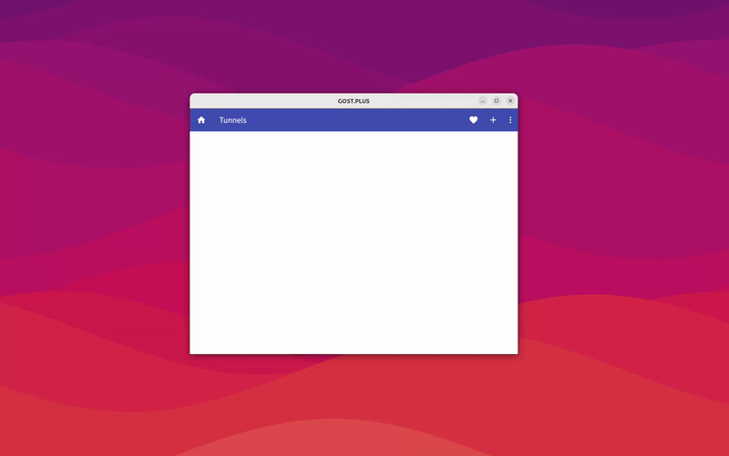

### HTTP Tunnel

Expose local HTTP service to the public network.

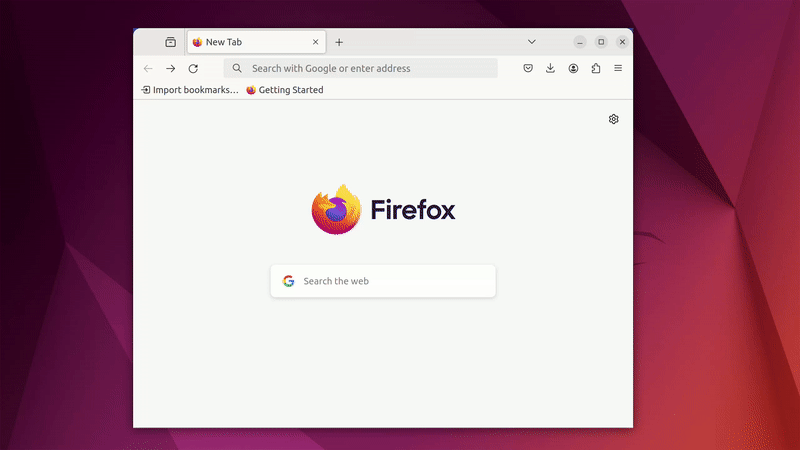

### TCP Tunnel

Expose local TCP service to the public network.

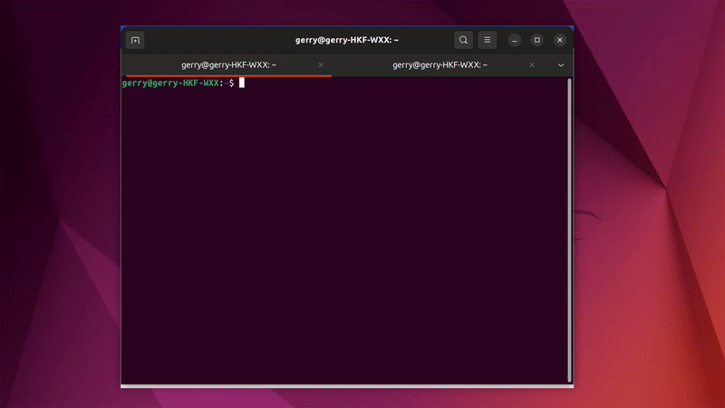

### UDP Tunnel

Expose local UDP service to the public network.

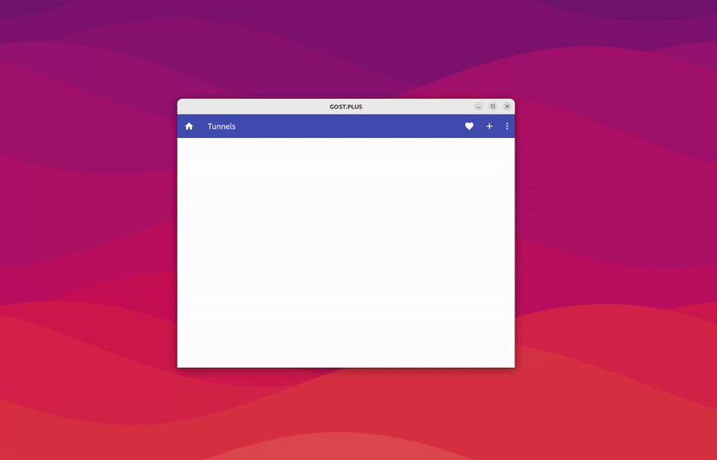

## Screenshot

### Desktop

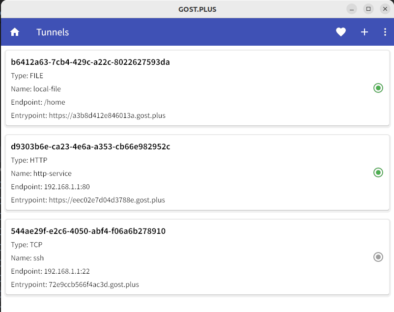
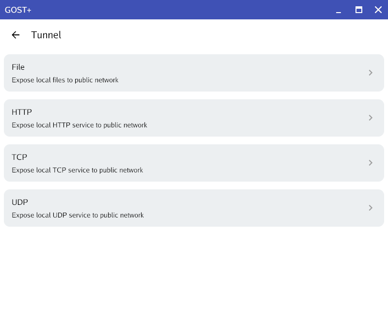
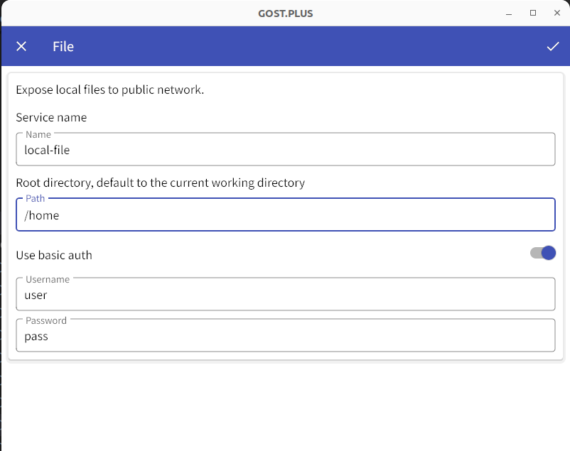
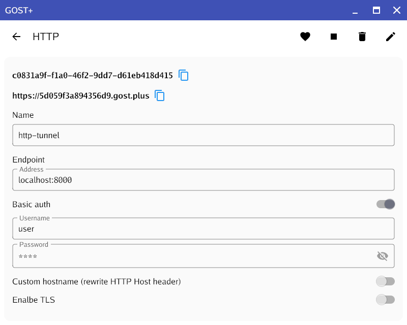

### Mobile

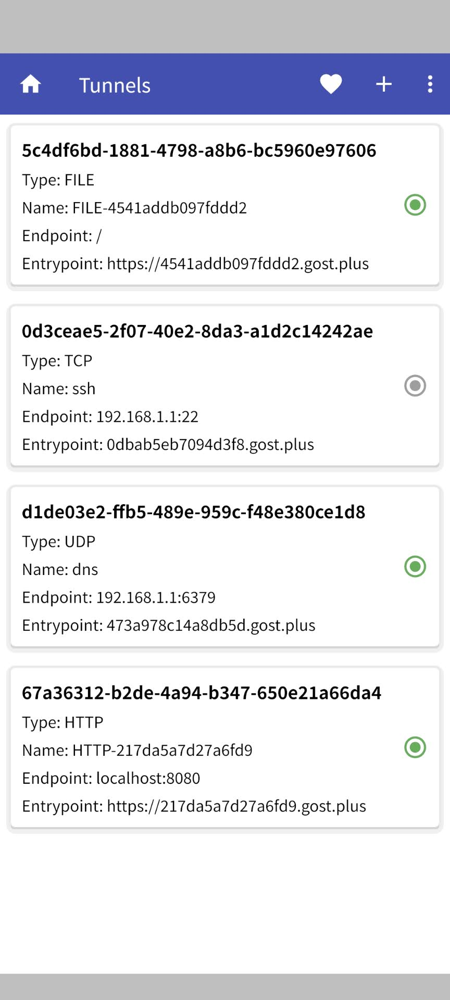
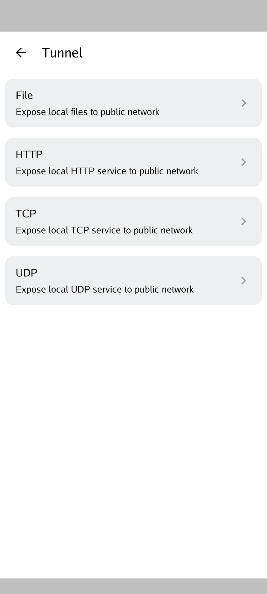
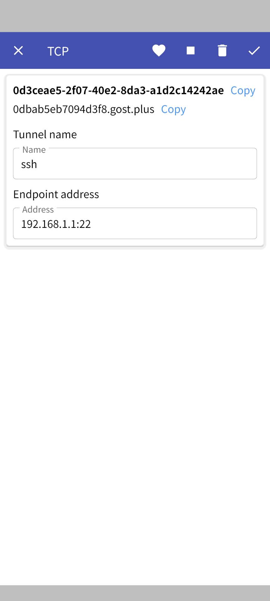